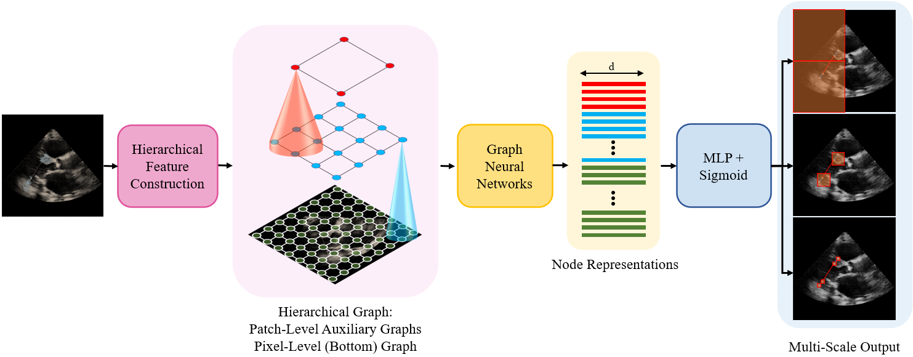

# EchoGLAD: Hierarchical Graph Neural Networks for Left Ventricle Landmark Detection on Echocardiograms

This repository provides the official PyTorch implementation of:

Masoud Mokhtari, Mobina Mahdavi, Hooman Vaseli, Christina Luong, Teresa Tsang, Purang Abolmaesumi, and Renjie Liao, [EchoGLAD: Hierarchical Graph Neural Networks for Left Ventricle Landmark Detection on Echocardiograms](Linktobeadded) (MICCAI 2023)

## Abstract
The functional assessment of the left ventricle chamber of the heart requires detecting four landmark locations and measuring the internal dimension of the left ventricle and the approximate mass of the surrounding muscle.
The key challenge of automating this task with machine learning is the sparsity of clinical labels, i.e., only a few landmark pixels in a high-dimensional image are annotated, leading many prior works to heavily rely on isotropic label smoothing. 
However, such a label smoothing strategy ignores the anatomical information of the image and induces some bias.
To address this challenge, we introduce an **echo**cardiogram-based, hierarchical **g**raph neural network (GNN) for **l**eft ventricle **la**ndmark **d**etection (EchoGLAD). 
Our main contributions are: 1) a hierarchical graph representation learning framework for multi-resolution landmark detection via GNNs; 2) induced hierarchical supervision at different levels of granularity using a multi-level loss. 
We evaluate our model on a public and a private dataset under the in-distribution (ID) and out-of-distribution (OOD) settings. 
For the ID setting, we achieve the state-of-the-art mean absolute errors (MAEs) of 1.46 mm and 1.86 mm on the two datasets. 
Our model also shows better OOD generalization than prior works with a testing MAE of 4.3 mm. 

<p align="center">

</p>

## Reproducing MICCAI 2023 Results

To reproduce our MICCAI 2023 results on the publicly available UIC dataset, follow the steps below. Please note that the provided weights are for the model trained on the UIC dataset (table provided in the supplementary material).

1. [Install the required packages](#requirements)
2. [Download the dataset](#dataset)
3. Update the dataset path in the `default.yml` config file (`configs/` directory) under `data.data_dir`
4. Update the dataset labels path in the `default.yml` config file (`configs/` directory) under `data.data_info_file`
4. Ensure the `model.checkpoint_path` in the config file points to `./trained_models/miccai2023.pth`
5. Run the command:
```
python run.py --config_path ./configs/default.yml --save_dir <dir_to_save_ouput_to> --eval_only True --eval_data_type test"
```

## Requirements

PyTorch and PyTorch Geometric must be separately installed based on your system requirements. In our implementation, we used Python 3.8.10 with the following:

```
pip install torch==1.10.0+cu113 torchvision==0.11.1+cu113 torchaudio==0.10.0+cu113 --extra-index-url https://download.pytorch.org/whl/cu113
pip install torch_geometric==2.0.2 torch_scatter==2.0.9 torch_sparse==0.6.12 torch_cluster==1.5.9 -f https://data.pyg.org/whl/torch-1.10.0+cu113.html
```

To install the rest of the requirements (preferably in a virtual environment), run:
```
pip install -r requirements.txt
```

## Dataset

We use the UIC public LV landmark dataset in this project. Access it [here](https://data.unityimaging.net/). Download the dataset to a convenient location and provide its directory in the config file as described in [Config File](#config-file). You additionally need the per-image pixel to mm ratio, which is not originally provided in the dataset. Please ask the dataset authors for 01_database_physical.csv.

## Training

To train the model (training + validation), create a training configuration yaml file similar to `/configs/default.yml`. Modify the config file as needed, consulting [Config File](#config-file).
Then, run:

```
python run.py --config_path <path_to_training_config> --save_dir <dir_to_save_ouput_to>
```

## Evaluation

To evaluate an already trained model, create a training configuration yaml file similar to `/configs/default.yml` that matches the trained model's specifications. Provide the path to the trained model using the `model.checkpoint_path` option in the config file. Finally, run:


```
python run.py --config_path <path_to_eval_config> --save_dir <dir_to_save_ouput_to> --eval_only True --eval_data_type test"
```

## Config File

The default configuration can be found in `./configs/default.yml`. Below is a summary of some important configuration options:

- **train**
  - *criterion*
    - *WeightedBceWithLogits*: 
      - ones_weight: the weight given to positive landmark locations in the image for loss evaluation
- *eval*
  - *standards*: Evaluation metrics computed for the model
  - *standard*: Metric used to decide when the best model checkpoint is saved (among the standards)
  - *maximize*: Determines whether the standard is to be maximized or minimized
- **model**
  - *checkpoint_path*: Path to the saved model for inference or continued training
  - *embedder*: Contains the config for the initial CNN expanding the images channel-wise
  - *landmark*:
    - *name*: Indicates the node feature construction type
    - *num_gnn_layers*: Number of GNN layers used to process the hierarchical graph
- **data**
  - *name*: Dataset name
  - *data_dir*: Path to the dataset
  - *data_info_file*: Path to the dataset labels dir
  - *use_coordinate_graph*: Indicates whether an average location node graph is created
  - *use_main_graph_only*: Indicates whether only a pixel level graph is created (as per ablation studies)

